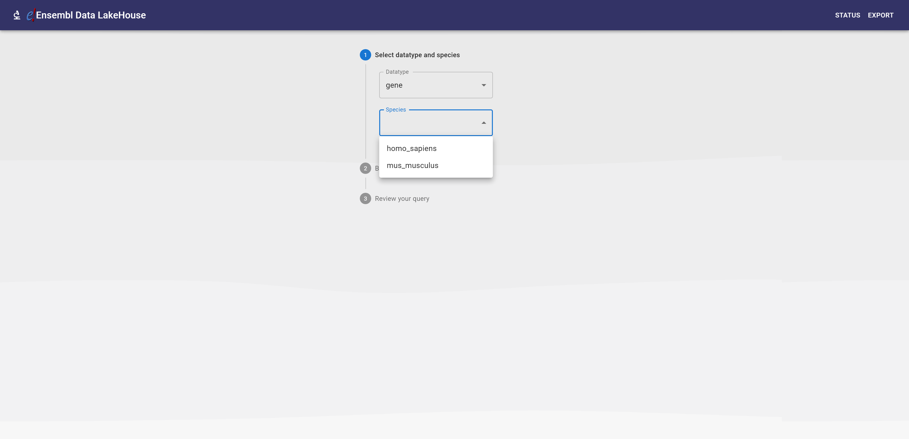
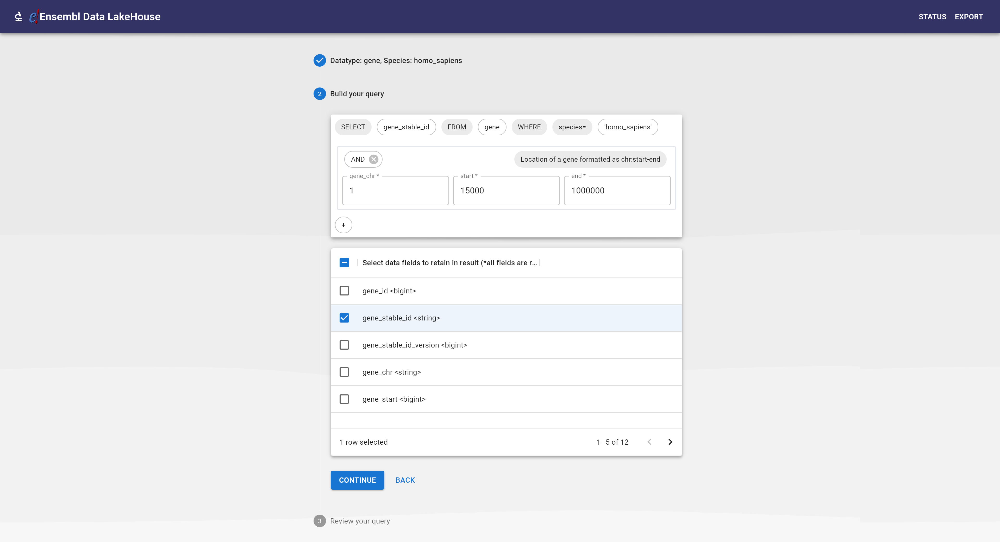
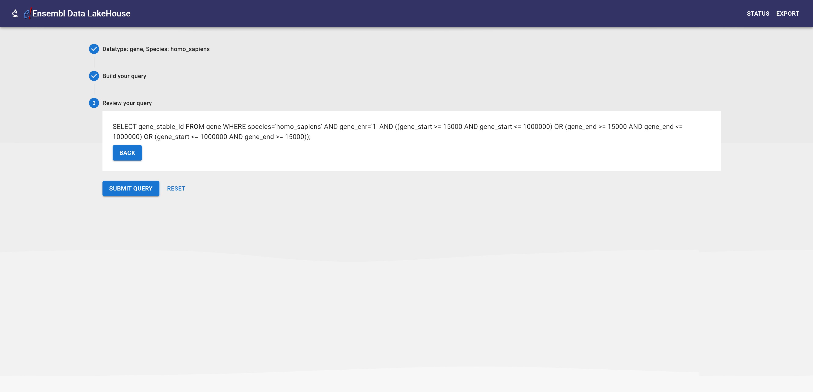
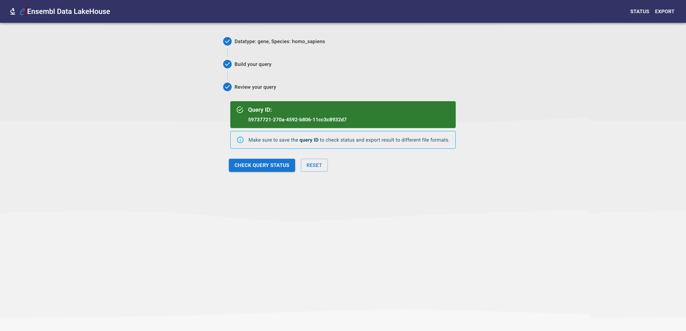
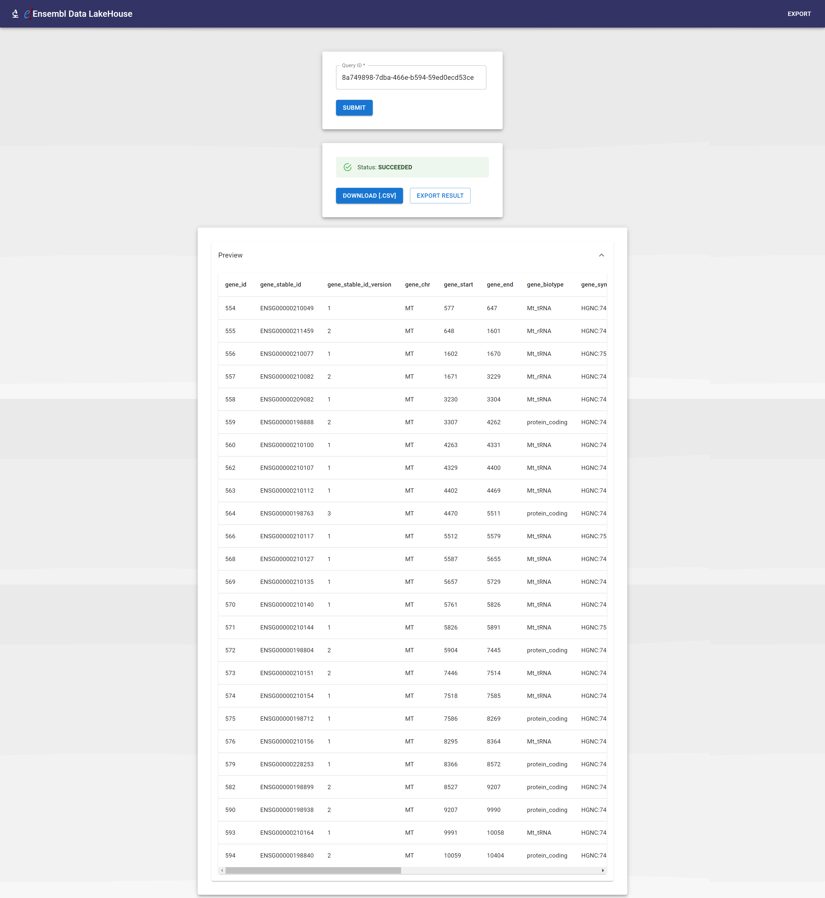

- [Google Summer of Code 2021](#google-summer-of-code-2021)
- [Accessing Ensembl data with Presto and AWS Athena](#accessing-ensembl-data-with-presto-and-aws-athena)
  - [Goal (problem statement)](#goal-problem-statement)
- [Solution: Ensembl Data LakeHouse](#solution-ensembl-data-lakehouse)
    - [**Proposal: https://drive.google.com/file/d/1jzyWmgahCU13WUwUIyndQMi7twdsikie/view?usp=sharing**](#proposal-httpsdrivegooglecomfiled1jzywmgahcu13wuwuiyndqmi7twdsikieviewuspsharing)
  - [Summary](#summary)
  - [System design](#system-design)
  - [Sub-components](#sub-components)
  - [AWS](#aws)
    - [AWS Athena](#aws-athena)
    - [AWS Glue](#aws-glue)
    - [AWS S3](#aws-s3)
    - [AWS ElastiCache](#aws-elasticache)
    - [AWS Amplify](#aws-amplify)
    - [AWS EC2](#aws-ec2)
  - [Achievements & optimisations:](#achievements--optimisations)
  - [UI snapshots:](#ui-snapshots)
  - [Future improvement suggestions/ideas:](#future-improvement-suggestionsideas)
  - [Acknowledgement](#acknowledgement)

# Google Summer of Code 2021
# Accessing Ensembl data with Presto and AWS Athena
Contributor: Rohit Shrivastava
- Email: rohitxsh@gmail.com
- LinkedIn: [linkedin.com/in/rohitxsh/](https://www.linkedin.com/in/rohitxsh/)
- GitHub: [github.com/rohitxsh/](https://github.com/rohitxsh/)

Mentored by [Andy Yates](https://github.com/andrewyatz), [Bilal El Houdaigui](https://github.com/bilalebi) and [Marc Chakiachvili](https://github.com/marcoooo) from EMBL-EBI Ensembl

 

## Goal (problem statement)
The goal of this project was to build a nextgen replacement for the [BioMart](http://ensembl.org/biomart/martview/) tool that provides a way to download custom reports of genes, transcripts, proteins and other data types. Considering the huge amount of data that needs to be dealt with in the area of genomic study, the current tool has very limited use cases because of scalability issues. The new tool will use the latest technologies available in the market such as AWS Athena (built on Presto), Parquet/ORC to build a scalable solution.

 

# Solution: Ensembl Data LakeHouse

### **Proposal: https://drive.google.com/file/d/1jzyWmgahCU13WUwUIyndQMi7twdsikie/view?usp=sharing**

## Summary
The focus of the end solution is to present a full-stack software that can demonstrate the feasibility of the proposed system architecture to counter the scalability issues. The solution consists of a python script which migrates the genomic data from Ensembl's MySQL database to parquet files which are then stored on AWS S3. The backend system provides a user friendly isolation via Application Programming Interface over the AWS APIs to request for required genomic data. The frontend allows user to interact with this system using a GUI to fetch the required genomic data for the desired datatype and species with appropriate filters.

## System design
ToDo
## Sub-components
- [Python script to migrate genomic data from MySQL DB to parquet files (with added support to upload thr files to AWS S3)](https://github.com/rohitxsh/sql2parquet_py)
  - The python script is responsible for exporting genomic data from Ensembl MySQL database to parquet files. It writes the output, parquet files to the defined S3 bucket.
  - Tech stack:
    - Python3
    - Boto3
    - pandas
  - Readme: [github.com/rohitxsh/sql2parquet_py/blob/main/README.md](https://github.com/rohitxsh/sql2parquet_py/blob/main/README.md)
  - Dependency: [TOML configuration file](https://github.com/rohitxsh/sql2parquet_py/blob/main/config.toml)
  - Tools:
    - Docker
  - Status: Deployed and ran successfully on an EC2 instance, parquet files uploaded to a AWS S3 bucket for human and mouse species

 

- [Ensembl's data lakehouse backend](https://github.com/rohitxsh/ensembl_lakehouse)
  - Readme (along with deployment details for Dockerfile): [github.com/rohitxsh/ensembl_lakehouse/blob/main/README.md](https://github.com/rohitxsh/ensembl_lakehouse/blob/main/README.md)
  - Tech stack: Python3, FastAPI, Celery, pandas, Boto3
  - Components
    - [API](https://github.com/rohitxsh/ensembl_lakehouse/blob/main/app/main.py):
      - The backend application is responsible for providing user friendly APIs for external users to interact with the underlying AWS services in a controlled manner.
      - Dependencies:
        - Redis (used as a cache and database)
        - Self-signed SSL certificate
      - Tools:
        - [Docker](https://github.com/rohitxsh/ensembl_lakehouse/blob/main/Dockerfile.api)
        - [Nginx](https://github.com/rohitxsh/ensembl_lakehouse/blob/main/nginx.conf)
        - [Postman collections](https://github.com/rohitxsh/ensembl_lakehouse/blob/main/ensembl_lakehouse.postman_collection.json)

      - Status: Deployed on an EC2 instance at [18.134.3.199](https://18.134.3.199/). EC2 instance is running Docker container behind a Nginx proxy.
    - [Celery worker](https://github.com/rohitxsh/ensembl_lakehouse/blob/main/app/tasks.py):
      - The celery worker machine is responsible for asynchronously polling and processing result file format export requests from Celery message queue. This service helps to provide the result in different custom file formats as Athena only supports the CSV format for generating result files. Because of the high in-memory nature of this service it is recommended to scale this service horizontally instead of scaling vertically. This can be achieved by adding more Celery worker machines. Based on the introspection, the recommended specification for worker machines are
        - RAM: 8 GB
        - CPU cores: 2 core
      - Tech stack:
        - Python3
        - Celery
        - pandas
      - Dependency: Redis (used as a cache and database)
      - Tools:
        - [Docker](https://github.com/rohitxsh/ensembl_lakehouse/blob/main/Dockerfile.celery)
      - Status: Deployed on an EC2 instance

 

  - [Ensembl's data lakehouse frontend](https://github.com/rohitxsh/ensembl_lakehouse_ui)
    - Tech stack:
      - React 18
      - TypeScript
      - Material UI
      - Tailwind CSS
    - Readme: [github.com/rohitxsh/ensembl_lakehouse_ui/blob/main/README_react.md](https://github.com/rohitxsh/ensembl_lakehouse_ui/blob/main/README_react.md)
    - Status: Auto-deployed via AWS Amplify at [main.d1y7s04512fj06.amplifyapp.com](https://main.d1y7s04512fj06.amplifyapp.com/)

## AWS
Budget utilised: <50% (includes setup + testing)
 
Estimated monthly costs: ~ $125

### [AWS Athena](https://aws.amazon.com/athena/)

**Introduction**: Amazon Athena is an interactive query service that makes it easy to analyze data in Amazon S3 using standard SQL.

**Details with context**: AWS Athena is responsible for querying genomic data from the parquet files stored in AWS S3. Athena fetch the schema from AWS Glue to process the SQL queries.

**Dependecies**:
  - Parquet files in AWS S3
  - Meta schema of the parquet files stored in a DB by AWS Glue

 

### [AWS Glue](https://aws.amazon.com/glue/)

**Introduction**: Amazon Glue is a serverless data integration service that makes it easy to discover, prepare, and combine data for analytics, machine learning, and application development.

**Details with context**: AWS Glue **Crawler** is responsible for fetching the meta schema of the genomic data parquet files stored in AWS S3 and writing those details to a database to be used by AWS Athena.

 

### [AWS S3](https://aws.amazon.com/s3/)

**Introduction**: Amazon S3 is a object storage to store and retrieve any amount of data.

 

### [AWS ElastiCache](https://aws.amazon.com/elasticache/)

**Introduction**: Amazon ElastiCache is a fully managed, in-memory caching service with support for Redis and Memcached.

**Details with context**: AWS ElastiCache is being to provide a Redis instance which is being utilised both as a cache and a database for ex.: task status of celery worker machines, caching Athena query IDs etc.

 

### [AWS Amplify](https://aws.amazon.com/amplify/)

**Introduction**: Amazon Amplify is a set of purpose-built tools and features that lets frontend web and mobile developers quickly and easily build full-stack applications on AWS, with the flexibility to leverage the breadth of AWS services.

**Details with ontext**: AWS Amplify is responsible for auto-deploying the frontend codebase without any additional tooling or configuation.

 

### [AWS EC2](https://aws.amazon.com/ec2/)

**Introduction**: Amazon Elastic Compute Cloud (Amazon EC2) is a web service that provides resizable compute capacity in the cloud.

**Details with ontext**: AWS EC2 is being used as a virtual machine to run the backend servers. All EC2 machines for Ensembl data lakehouse are running on Ubuntu 22 base image.

 

## Achievements & optimisations:
 - The output files from the python script are structured using **Hive style partitioning** where the top directory denotes the data type, and sub-directory denotes the species, for example: S3 URI for gene of homo_sapiens will be *s3://ensembl-genome-data-parquet/gene/**species=homo_sapiens**/homo_sapiens_core_106_38-gene.parquet*. Hive style partitioning is supported by Athena, which helps to optimise the data querying process by limiting the number of parquet files to be referenced by Athena.
 - Athena treats each new/duplicate query as a seperate request. It does retain the history of query IDs for a period of 45 days so identifying duplicate queries and reusing query IDs from cache helps to reduce AWS cost as the system scales.
 - The system can be easily extended for more species and datatype as there are no hard-code dependencies which proves the system is also dynamic in nature and can be easily update using configuration files to add more dataypes and species in future.
 - In the frontend UI, last successful query ID is cached in localstorage and auto-populated on status and export page.

 

## UI snapshots:

- [Google Summer of Code 2021](#google-summer-of-code-2021)
- [Accessing Ensembl data with Presto and AWS Athena](#accessing-ensembl-data-with-presto-and-aws-athena)
  - [Goal (problem statement)](#goal-problem-statement)
- [Solution: Ensembl Data LakeHouse](#solution-ensembl-data-lakehouse)
    - [**Proposal: https://drive.google.com/file/d/1jzyWmgahCU13WUwUIyndQMi7twdsikie/view?usp=sharing**](#proposal-httpsdrivegooglecomfiled1jzywmgahcu13wuwuiyndqmi7twdsikieviewuspsharing)
  - [Summary](#summary)
  - [System design](#system-design)
  - [Sub-components](#sub-components)
  - [AWS](#aws)
    - [AWS Athena](#aws-athena)
    - [AWS Glue](#aws-glue)
    - [AWS S3](#aws-s3)
    - [AWS ElastiCache](#aws-elasticache)
    - [AWS Amplify](#aws-amplify)
    - [AWS EC2](#aws-ec2)
  - [Achievements & optimisations:](#achievements--optimisations)
  - [UI snapshots:](#ui-snapshots)
  - [Future improvement suggestions/ideas:](#future-improvement-suggestionsideas)
  - [Acknowledgement](#acknowledgement)

 

## Future improvement suggestions/ideas:
UI/UX improvements
- Include query creation datetime along with the status of the query ID.
- The filter fields on the query build step in UI should have proper validations and should not allow empty or invalid inputs
- Status page should also include a table which should automatically show the status of last five query IDs along with other details such as creation datetime, query submitted etc. to help identify queries. This can be achieved using local browser WebStorage
- Add option to store named queries to easily identify queries
- Allow users to auto-populate fields in query builder using older query IDs to help with cases when only small modifications are required.
- Auto-refresh status and export page until status is Done
Best practices:
  - Incorporate tests in the codebase for example: unit tests
Scaling the system:
  - Add more species
  - Incorporate an alert and monitoring system
Analytics:
  - Use logs to identify common request patterns
  - Integrate a privacy focused web analytics tool in the frontend to identify areas of improvement based on common user patterns

## Acknowledgement
I would like to thank Andy Yates, Bilal El Houdaigui and Marc Chakiachvili for the constant support, invaluable learnings and guidance throughout my GSoC journey.